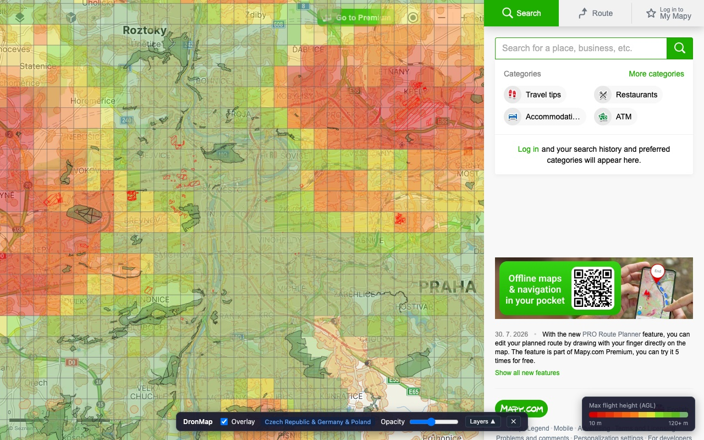
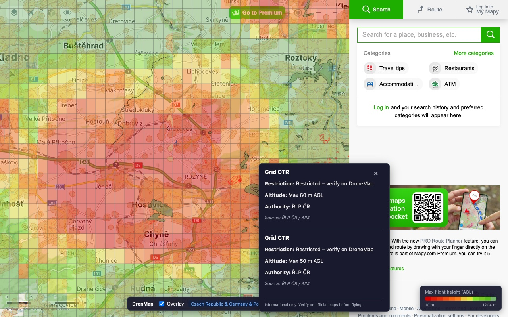
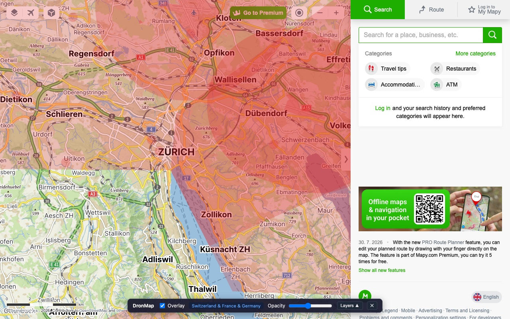
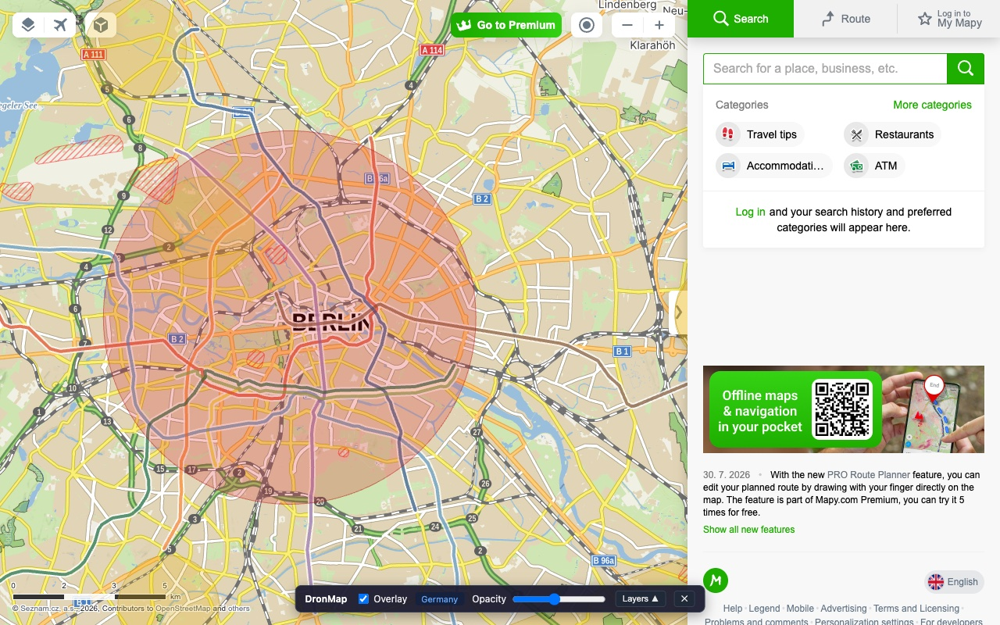
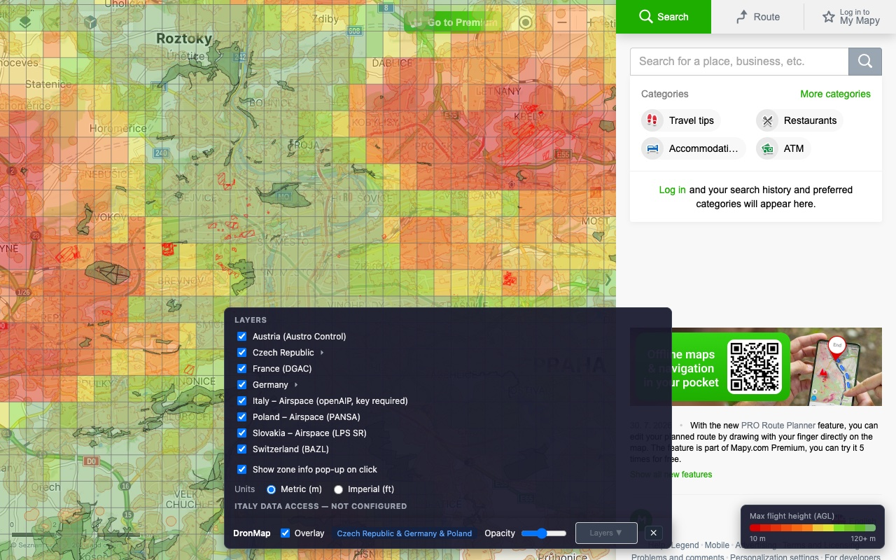

# DroneMapy – Drone Zones on Mapy.com


**[Get it on the Chrome Web Store](https://chromewebstore.google.com/detail/dronemapy-%E2%80%93-drone-zones-o/hdaedlckhmomfjflbialfmdcebmiaejl)** · [dronemapy.com](https://dronemapy.com)

Chrome extension that overlays **drone restriction zones** directly on [mapy.com](https://mapy.com) — the map you already use for planning trips. Covers **Switzerland, Czech Republic, France, Germany, Austria, Poland, Slovakia and Italy**, loading official airspace data live for whatever part of the map you're looking at.

Plan your hike or ride on mapy.com and instantly see where your drone can and cannot fly — no switching between the national drone maps.

*Independent project — not affiliated with Mapy.com (Seznam.cz) or any aviation authority.*

## Screenshots

Czech drone restriction grid over Prague, with the DroneMapy toolbar at the bottom:



Click any zone to see what applies there — restriction, altitude limit, and the authority behind it:



Swiss BAZL zones around Zurich and the German control zone over Berlin:





Per-country layers, click pop-ups, units, and offline data live in the expandable panel:



## Install

Get it from the **[Chrome Web Store](https://chromewebstore.google.com/detail/dronemapy-%E2%80%93-drone-zones-o/hdaedlckhmomfjflbialfmdcebmiaejl)**.

Or install from source:

```bash
git clone https://github.com/petrcezner/dronemapy.git
cd dronemapy
npm install
npm run build
```

Then load it in Chrome:

1. Open `chrome://extensions`
2. Enable **Developer mode**
3. Click **Load unpacked**
4. Select the `extension/dist` folder

## Usage & controls

1. Open [mapy.com](https://mapy.com) — a **DroneMapy** toolbar appears at the bottom of the map
2. Use the **Overlay** toggle and opacity slider to blend zones with the map
3. Click **Layers ▲** to expand per-country layer toggles, click pop-ups, units, and offline options
4. Click the map (tap without dragging) to inspect zone details
5. Click the extension icon in Chrome to show/hide the toolbar

## Coverage

| Country | Data | Source |
| --- | --- | --- |
| 🇨🇭 Switzerland | BAZL drone zones, optional offline mode | [geo.admin.ch](https://map.geo.admin.ch) |
| 🇨🇿 Czech Republic | ŘLP drone zones + click details | [aimgis.rlp.cz](https://aimgis.rlp.cz) |
| 🇫🇷 France | DGAC/IGN UAS restrictions + click details | [data.geopf.fr](https://data.geopf.fr) |
| 🇩🇪 Germany | DIPUL — control zones, restriction areas, airports, military, nature reserves | [uas-betrieb.de](https://uas-betrieb.de/geoservices/dipul/wfs) |
| 🇦🇹 Austria | Austro Control geo zones | [dronespace.at](https://utm.dronespace.at/avm/) |
| 🇵🇱 Poland | Classic airspace + daily AUP reservations (see note) | [airspace.pansa.pl](https://airspace.pansa.pl) |
| 🇸🇰 Slovakia | Classic airspace (see note) | [gis.lps.sk](https://gis.lps.sk/vfrm) |
| 🇮🇹 Italy | Classic airspace via openAIP — free API key required (see note) | [openAIP](https://www.openaip.net) |

### Note on Italy coverage

Italy's official UAS geo zones are **not available** to this extension. ENAC/ENAV's
d-flight platform gates every geodata endpoint behind a login
(`allowAnonUser: false`), protects that login with a client-specific CSRF
handshake that only its own web app can produce, and publishes no open ED-269
mirror. Check official Italian geo zones on [d-flight](https://www.d-flight.it/web-app/).

What the extension can show is **classic airspace (P/R/D/CTR/ATZ…)** from
openAIP. Paste a free [openAIP API key](https://www.openaip.net) into the
panel's **Italy data access** field; it is stored on your device only (see
[PRIVACY.md](PRIVACY.md)). Until then, clicking in Italy shows a hint instead
of zones.

### Note on Poland & Slovakia coverage

PL and SK layers show **classic airspace (P/R/CTR/TRA…)**, not the legal UAS geographical zones:

- Poland's DRA geozones live behind `api.dronemap.pansa.pl`, which requires an API key issued by PANSA (not self-service). Future work: an options field for a user-supplied key.
- Slovakia's geozones are published by Dopravný úrad (NSAT) only as a KML inside a ZIP at a changing URL. Future work: fetch + convert that dataset.

## How it works

- Zones load for **your current viewport** only: the map is split into ~0.25° grid tiles with a one-tile padding ring, and only nearby tiles are fetched where the API allows it
- Overlays are **crisp vectors drawn on canvas** — no blurry WMS raster layers
- Rendering waits for the pan/zoom gesture to settle (~350 ms), so the map stays smooth while you move around
- Switzerland works online out of the box; you can also **download the full Swiss dataset (~13 MB)** from the panel into IndexedDB for instant offline repeat visits
- Austria's country-wide GeoJSON is fetched once per session and clipped per tile; Poland's airspace feed loads once and includes the day's AUP reservations

## Disclaimer

This extension is an **informational aid only**. Always verify restrictions on official maps before flying:

- Switzerland: [geo.admin.ch](https://map.geo.admin.ch/#/map?lang=en&layers=ch.bazl.einschraenkungen-drohnen)
- Czech Republic: [dronemap.gov.cz](https://dronemap.gov.cz/index.php?dron)
- France: [Géoportail](https://www.geoportail.gouv.fr/donnees/restrictions-uas-categorie-ouverte-et-aeromodelisme)
- Germany: [DIPUL map tool](https://maptool-dipul.dfs.de/)
- Austria: [dronespace.at](https://utm.dronespace.at/avm/)
- Poland: [dronemap.pansa.pl](https://dronemap.pansa.pl)
- Slovakia: [NSAT geo zones](https://letectvo.nsat.sk/bezpilotne-letectvo/zemepisne-oblasti-uas/) + [VFR Manual](https://gis.lps.sk/vfrm)
- Italy: [d-flight](https://www.d-flight.it/web-app/)

## Data sources & attribution

| Region | Source | License / attribution |
| --- | --- | --- |
| Switzerland | [data.geo.admin.ch](https://data.geo.admin.ch/ch.bazl.einschraenkungen-drohnen/) | Opendata BY – BAZL |
| Czech Republic | [aimgis.rlp.cz](https://aimgis.rlp.cz) REST | ŘLP ČR / AIM |
| France | [data.geopf.fr](https://data.geopf.fr) WFS | Licence Ouverte 2.0 – DGAC |
| Germany | [uas-betrieb.de](https://uas-betrieb.de/geoservices/dipul/wfs) WFS | CC BY-ND 4.0 – "dipul, CC-BY-ND 4.0" |
| Austria | [utm.dronespace.at](https://utm.dronespace.at/avm/) GeoJSON | © Austro Control GmbH (dronespace.at) |
| Poland | [airspace.pansa.pl](https://airspace.pansa.pl) JSON | PAŻP / PANSA — informational, verify NOTAM/AUP |
| Slovakia | [gis.lps.sk](https://gis.lps.sk/vfrm) ArcGIS | "VFR Manual, LPS SR š. p." – [gis.lps.sk/vfrm](https://gis.lps.sk/vfrm) |
| Italy | [openAIP](https://www.openaip.net) API (user's key) | openAIP contributors — airspace, not UAS geo zones |

## Development

### Prerequisites

- Node.js 20+ (CI runs Node 22, see `.nvmrc`)
- Google Chrome

### Setup

```bash
npm install
npm run dev
```

Then load the unpacked extension from `extension/dist` as described in [Install](#install).

### Build for production

```bash
npm run build
```

### Tests

```bash
npm test
```

### Pre-commit hooks

`npm install` sets up a git pre-commit hook (via [husky](https://typicode.github.io/husky/)) that runs
ESLint on staged files (with autofix), `tsc --noEmit`, and the test suite. To skip it in an
emergency, use `git commit --no-verify`.

### Project structure

```text
extension/
  manifest.json
  src/
    background/     # Service worker (tile index, settings, icon click)
    content/        # Map adapter, overlay, map panel, click handler
    data/           # Grid tiles, vector loader, projection, regions
    styles/         # Overlay + panel CSS
```

### Manual QA checklist

- [ ] Open mapy.com with extension loaded — bottom toolbar visible, no console errors
- [ ] Pan/zoom rapidly — map stays smooth; sharp vector zones update ~350ms after stopping
- [ ] Toggle overlay off/on from bottom bar
- [ ] Click extension icon — toolbar hides/shows
- [ ] Prague (`?x=14.43&y=50.08&z=12`) — CZ vector polygons visible after settle (no PNG flicker)
- [ ] Zurich (`?x=8.54&y=47.37&z=12`) online — CH vectors from REST without download
- [ ] Download Swiss tiles from expanded panel, then Zurich offline — vectors from IndexedDB
- [ ] Berlin (`?x=13.40&y=52.52&z=12`) — DE control zone + zones render
- [ ] Vienna (`?x=16.37&y=48.21&z=12`) — AT geo zones render
- [ ] Warsaw (`?x=21.01&y=52.23&z=12`) — PL airspace renders (first load fetches the country feed)
- [ ] Bratislava (`?x=17.11&y=48.15&z=12`) — SK + AT zones render together (border overlap)
- [ ] Click a restricted area — info panel shows zone details
- [ ] Toggle each layer off/on — its zones disappear/reappear

## Privacy

See [PRIVACY.md](PRIVACY.md).
